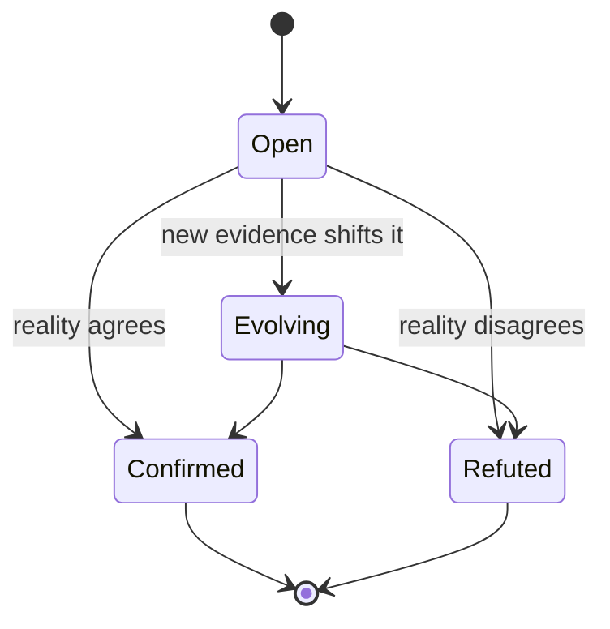

# The Thesis Ledger

This is the wiki's **calibration spine**. The rest of the knowledge base records what happened and what's true; this section records what I'm *betting on* — forward-looking, falsifiable claims, each grounded in the corpus, given a confidence, and graded against reality over time.

The point isn't to be right. It's to be **calibrated** — to find out, on a schedule, where my judgment is sharp and where it's a good story I tell myself. A scored bet is also the seed of an essay with receipts.

> [!TIP] How a thesis works
> Every thesis carries four things a hunch doesn't: **a falsifiable claim**, **the evidence** (linked into the corpus), **a falsification condition** (what would prove it wrong), and **a dated scorecard** you add to at each review. Open one from the `thesis` template in this folder. Keep confidence honest — a wall of 90%s means you're not betting on anything hard enough.

## Lifecycle



## Open bets

| Thesis | Conf. | Review by | Status |
| --- | :---: | --- | --- |
| [Bounded agents beat autonomy](./bounded-agents-beat-autonomy.md) — the harness is the moat | 75% | 2026-12-31 | open |
| [Decouple the CDN from the platform](./decouple-cdn-from-platform.md) | 70% | 2026-09-30 | open |
| [The generalist's edge compounds](./the-generalist-edge-compounds.md) *(keystone)* | 65% | 2027-06-30 | open |
| [Sprints can't build complex platforms](./sprints-cant-build-complex-platforms.md) *(contested)* | 60% | 2026-12-31 | open |

```html preview h=220px
<div style="font-family:system-ui;padding:18px 4px;color:var(--foreground)">
  <div style="font-size:13px;color:var(--muted-foreground);margin-bottom:12px">Confidence on open bets — honest spread, not a wall of certainty</div>
  <div style="display:flex;flex-direction:column;gap:10px">
    <div style="display:flex;align-items:center;gap:10px">
      <div style="width:200px;font-size:13px">Bounded agents beat autonomy</div>
      <div style="flex:1;height:18px;background:var(--muted);border-radius:var(--radius);overflow:hidden"><div style="width:75%;height:100%;background:var(--chart-1)"></div></div>
      <div style="width:40px;font-size:13px;text-align:right">75%</div>
    </div>
    <div style="display:flex;align-items:center;gap:10px">
      <div style="width:200px;font-size:13px">Decouple CDN from platform</div>
      <div style="flex:1;height:18px;background:var(--muted);border-radius:var(--radius);overflow:hidden"><div style="width:70%;height:100%;background:var(--chart-2)"></div></div>
      <div style="width:40px;font-size:13px;text-align:right">70%</div>
    </div>
    <div style="display:flex;align-items:center;gap:10px">
      <div style="width:200px;font-size:13px">Generalist's edge compounds</div>
      <div style="flex:1;height:18px;background:var(--muted);border-radius:var(--radius);overflow:hidden"><div style="width:65%;height:100%;background:var(--chart-3)"></div></div>
      <div style="width:40px;font-size:13px;text-align:right">65%</div>
    </div>
    <div style="display:flex;align-items:center;gap:10px">
      <div style="width:200px;font-size:13px">Sprints can't build platforms</div>
      <div style="flex:1;height:18px;background:var(--muted);border-radius:var(--radius);overflow:hidden"><div style="width:60%;height:100%;background:var(--chart-4)"></div></div>
      <div style="width:40px;font-size:13px;text-align:right">60%</div>
    </div>
  </div>
</div>
```

*No theses have resolved yet — this section will grow a settled-bets table (and a hit rate) as reviews land.*

## Candidate theses to develop

Unwritten bets already latent in the corpus — promote one to a full thesis when it's worth tracking:

- **AEO/GEO becomes RFP table-stakes within 18 months** — designing for AI as a first-class site visitor moves from pitch differentiator to baseline requirement.
- **AI-provenance questions become standard in client procurement** — "how much of this was built with AI?" (the Pentagram question) becomes a routine line in RFPs and MSAs.
- **Margin, not revenue, is AREA 17's real constraint** — over-servicing (margins at 17–18% vs. a 25–35% target) caps the firm's health more than topline does.
- **Design systems and accessibility are a durable moat** — "foundation before surface" survives AI commoditization because the machines skip the foundation.
- **The terminal stays mainstream** — direct instruction of machines (natural-language + CLI) keeps widening, not narrowing, as the default interface.

## Review cadence

The weekly [recaps](/notes/weekly/2026-06-20-recap.md) are the adjudication stream — each one is a chance to add a dated line to a scorecard. Do a deliberate pass on every open thesis at its review date; sooner if reality forces the issue.